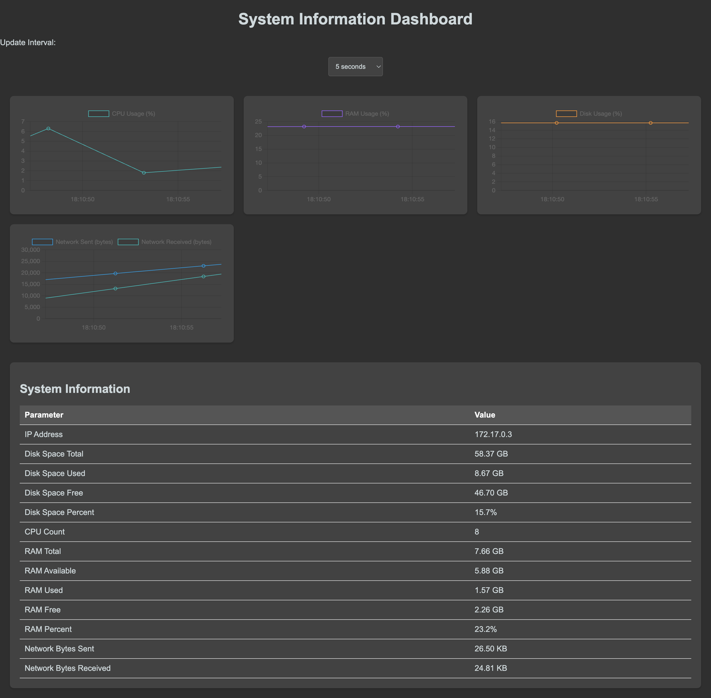

# **INTRODUCTION**

This Flask application provides a real-time system information dashboard. It displays CPU, RAM, disk, and network usage.

## Features

- Real-time charts for CPU, RAM, disk, and network usage.
- Detailed system information displayed in a table.
- User-configurable update intervals for data refresh.



## Prerequisites

- Docker
- Node.js and npm (for local SASS compilation)

## Setup

### 1. Clone the Repository

```bash
git clone https://github.com/rahulkumar-aws/system-info-app.git
cd system-info-app
```

### 2. Compile SASS to CSS (Optional, if not using Docker for SASS compilation)

If you are not using Docker to compile SASS to CSS, you can compile it locally:

```bash
sass static/sass/styles.scss static/css/styles.css
```

### 3. Build and Run the Docker Container

Build the Docker image:

```bash
docker build -t system-info-app .
```

Run the Docker container:

```bash
docker run -p 5001:5001 system-info-app
```

### 4. Access the Application

http://localhost:5001/graphs

### Local development setup

```bash
python -m venv venv
#Windows
venv\Scripts\activate
#MacOS
source venv/bin/activate
```

```bash
pip install Flask psutil
```

```bash
pip freeze > requirements.txt
```

```bash
docker build -t system-info-app .
```

### Project Structure

```sql
system-info-app/
│
├── app.py
├── Dockerfile
├── requirements.txt
├── static/
│   ├── css/
│   │   └── styles.css
│   └── sass/
│       └── styles.scss
└── templates/
    ├── index.html
    └── graphs.html
```

### Contributing

**Fork the repository.**

Create a new branch: 
```bash
git checkout -b feature-branch
```
Make your changes and commit them: 
```bash
git commit -m 'Added some feature'
```
Push to the branch: 
```bash
git push origin feature-branch
```
Submit a pull request.
